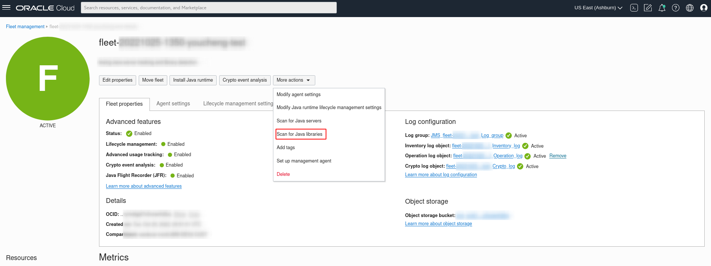
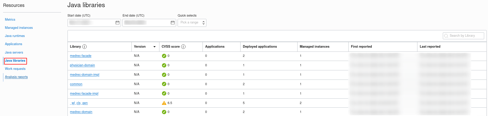

# Detect Java Libraries

## Introduction

Advanced usage tracking allows you monitor the usage of **Java libraries** in your fleet.
This lab walks you through the steps to detect **Java libraries** in your fleet.

Estimated Time: 30 minutes

### Objectives

In this lab, you will:

* Detect Java libraries for deployed Java Web Application on a running Java Server.
* Detect Java libraries for deployed Java SE application.
* Verify Java libraries detection.


### Prerequisites

* You have signed up for an account with Oracle Cloud Infrastructure and have received your sign-in credentials.
* You are using an Oracle Linux image on your Managed Instance for this workshop.
* A compute instance with the resources configured in Lab 4.

## Task 1: Detect Java libraries for deployed Java Web Application.

1. In lab 4, we have set up the running WebLogic server with sample java web application. Please ensure that WebLogic server is still running.
* You may want to refer to Lab 4, Task 3 to restart your server if necessary.

2. In **Java Management** page, click **Scan for Java libraries**.
 

3. In the same **Java Management** page, under **Resource**,select **Work Request**.You should see the Scan for Java libraries Work Request you submitted in step 2.  
If your request was successful, you should see that the Status of the request is marked as Succeeded and Completed without errors.It may take around 10 minutes to be completed.

  

4. In the same **Java Management** page, under **Resource**, select **Java libraries** you should be able to see detected Java libraries that we included in the pom.xml file for the deployed sample Java Web Application.



5. You can stop the WebLogic server now by pressing **ctrl + c**.


## Task 2: Create Sample Java SE Application.

1. Create sample Java Web Application by running.
* If you are not already in the home directory of your compute instance, navigate there by running this.
```
    <copy>
    cd ~
    </copy>
```
* Create sample Java SE Application by running.
```
    <copy>
    mvn archetype:generate -DgroupId=com.sample -DartifactId=GreetingApp -DarchetypeArtifactId=maven-archetype-quickstart -DinteractiveMode=false
    </copy>
```
```
    <copy>
    cd ./GreetingApp
    </copy>
```

2. Edit main Java class by running.
```
    <copy>
    nano src/main/java/com/sample/App.java
    </copy>
```
* Replace the content as following.
```java
    <copy>
    package com.sample;
import com.google.gson.Gson;
import java.text.SimpleDateFormat;
import java.util.*;
public class App
{
    public static void main(String[] args)
    {
        System.out.println("Greeting message in format of Json will be printed every 20 secs");
        final Map<String, String> map = new HashMap<String, String>();
        map.put("Message", "Hello, World!");
        Timer t = new Timer();
        t.schedule(new TimerTask() {
            @Override
            public void run() {
                map.put("Time", new SimpleDateFormat("yyyy-MMM-dd HH:mm:ss").format(new java.util.Date()));
                System.out.println(new Gson().toJson(map));
            }
        }, 0, 20000);
    }
}
    </copy>
```
3. Edit pom.xml configuration file by running.
```
    <copy>
    nano pom.xml
    </copy>
```
* Replace the content as following.
```xml
    
<copy>
	<project
		xmlns="http://maven.apache.org/POM/4.0.0"
		xmlns:xsi="http://www.w3.org/2001/XMLSchema-instance"
  xsi:schemaLocation="http://maven.apache.org/POM/4.0.0 http://maven.apache.org/maven-v4_0_0.xsd">
		<modelVersion>4.0.0</modelVersion>
		<groupId>com.sample</groupId>
		<artifactId>GreetingApp </artifactId>
		<packaging>jar</packaging>
		<version>1.0-SNAPSHOT</version>
		<name>AppTest</name>
		<url>http://maven.apache.org</url>
		<dependencies>
			<dependency>
				<groupId>junit</groupId>
				<artifactId>junit</artifactId>
				<version>3.8.1</version>
				<scope>test</scope>
			</dependency>
			<dependency>
				<groupId>com.google.code.gson</groupId>
				<artifactId>gson</artifactId>
				<version>2.9.0</version>
			</dependency>
		</dependencies>
		<build>
			<plugins>
				<plugin>
					<groupId>org.apache.maven.plugins</groupId>
					<artifactId>maven-assembly-plugin</artifactId>
					<executions>
						<execution>
							<phase>package</phase>
							<goals>
								<goal>single</goal>
							</goals>
							<configuration>
								<archive>
									<manifest>
										<mainClass>com.sample.App</mainClass>
									</manifest>
								</archive>
								<descriptorRefs>
									<descriptorRef>jar-with-dependencies</descriptorRef>
								</descriptorRefs>
							</configuration>
						</execution>
					</executions>
				</plugin>
			</plugins>
		</build>
	</project>
</copy>
```
3. Build Java SE Application as executable jar file by running.
```
    <copy>
        mvn clean package
    </copy>
```
* ou should able to see the output similar as following after successfully build.

4. Run Java SE application by running.
```
    <copy>
        sudo java -jar ./target/GreetingApp-1.0-SNAPSHOT-jar-with-dependencies.jar
    </copy>
```

## Task 3: Detect Java libraries for running Java SE Application.

1. Follow Task 1, step 2-3 to initialize Java libraries scan.

2. In the same **Java Management** page, under **Resource**, select **Java libraries**,  you should be able to see extra Java libraries named Gson that we included in sample GreetingApp are added to result now.


3. Click the Gson library , you should able to see details of sample Java SE application that we deployed in the previous step


 
4. You can stop the Java SE application by pressing **ctrl + c**.  


 You may now **proceed to the next lab.**


## Learn More
* Refer to the [Java Runtime Lifecycle Management](https://docs.oracle.com/en-us/iaas/jms/doc/advanced-features.html#GUID-08673CB1-D87D-4BC5-A61D-E59DCC879ABB), [Work Request](https://docs.oracle.com/en-us/iaas/jms/doc/getting-started-java-management-service.html#GUID-47C63464-BC0C-4059-B552-ED9F33E77ED3) and [Viewing a Work Request](https://docs.oracle.com/en-us/iaas/jms/doc/fleet-views.html#GUID-F649F0E5-DD54-4DEC-A0F1-942FE3552C93) sections of the JMS documentation for more details.

* Use the [Troubleshooting](https://docs.oracle.com/en-us/iaas/jms/doc/troubleshooting.html#GUID-2D613C72-10F3-4905-A306-4F2673FB1CD3) chapter for explanations on how to diagnose and resolve common problems encountered when installing or using Java Management Service.

* If the problem still persists or it is not listed, then refer to the [Getting Help and Contacting Support](https://docs.oracle.com/en-us/iaas/Content/GSG/Tasks/contactingsupport.htm) section. You can also open a support service request using the **Help** menu in the OCI console.

## Acknowledgements

* **Author** - Yixin Wei, Java Management Service
* **Last Updated By** - Yixin Wei, September 2022
