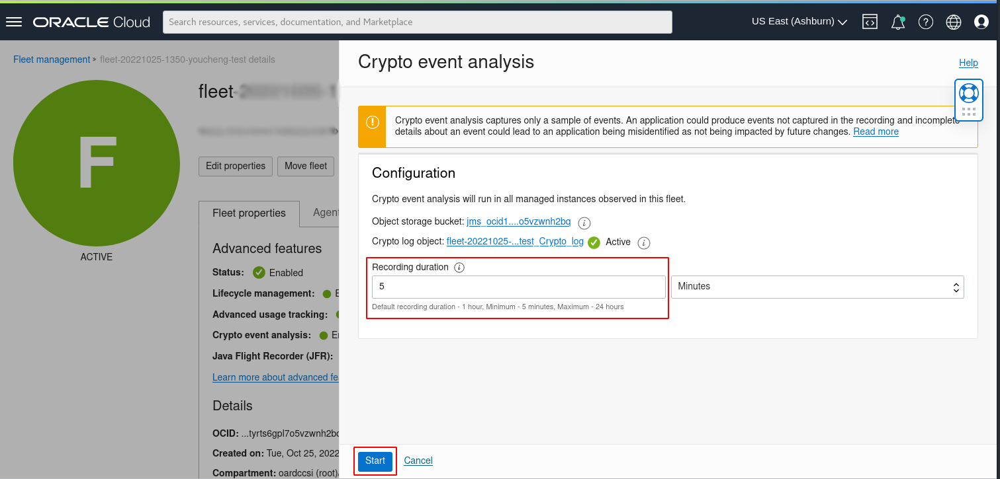
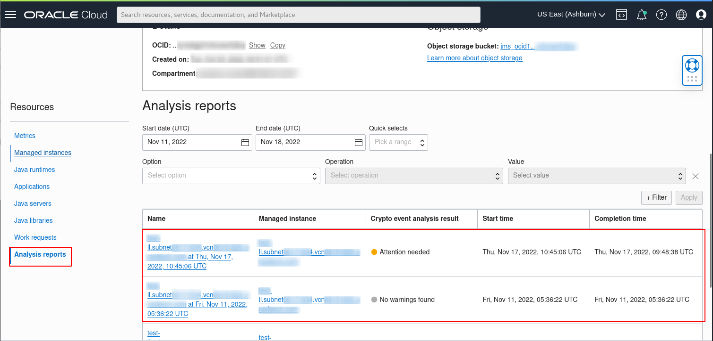

# Run Crypto Event Analysis

## Introduction

This lab walks you through the steps to run a Crypto Event Analysis on your Fleet.

Estimated Time: 1 hour

### Objectives

In this lab, you will:

* Create a Crypto Event Analysis Work Request using the Java Management Service console interface.
* View and monitor the status of Work Requests created using the Java Management Service console interface.
* View/download the generated Crypto Event Analysis report..


### Prerequisites

* You have signed up for an account with Oracle Cloud Infrastructure and have received your sign-in credentials.
* You are using an Oracle Linux image or Windows OS on your Managed Instance for this workshop.
* Access to the cloud environment and resources configured in [Lab 1](?lab=set-up-and-enable-lcm-on-jms).
* Have java applications running in your instance from [Lab X](?lab=xxxx-xxxx-xxxx-xxxx-xxxx).

## Task 1: Submit Crypto Event Analysis Work Request

1. First, open the navigation menu, click **Observability & Management**, and then click **Fleets** under **Java Management**. Select the fleet that you are interested in.
  
    

2. Click the button labeled **Crypto event analysis**.
  
    

3. Set the duration of the run under **Recording duration in hours** and click **Start** button.
  
    
  
    > **Note:** You can keep it as the default duration of 1 hour.

4. Scroll down and under **Resources**, select **Work requests**. You should see a list of the Work Requests that are currently in your Fleet. **Crypto event analysis** that was started should be at the top of the list.
  
    

    >**Note:** If you have set the **Recording duration in hours** to 1 hours It will take approximately 1.5 hours for the request to be completed.

6. Wait for the work request to show as complete.
  
    

    >**Note:** It will take approximately 1 hour for the request to be completed.

5. Once the work request shows as complete, scroll down and under **Resources**, select **Analysis reports**. You should see a list of the Crypto analysis reports that have been conducted in your Fleet. **Crypto event analysis** that has completed should be on top of the list.
  
    


## Task 2: **(Optional)** Download Crypto Event Analysis Report's Raw Copy

1. You can download the analysis report from the bucket. To do so, from the **Fleet** details page, click the **Object storage bucket** name under **Object storage**
    >
    >

2. Your **Crypto event analysis** report's raw copy is stored in the folder **JMS** > **ANALYSIS** > **CRYPTO** > **RESULTS** > **fleet-ocid** > **instance-ocid** > **CryptoAnalysisResult** json file(s). 
  
    

    <details>
      <summary>JSON schema of Crypto Analysis Result</summary>

      ```javascript
      {
        timeAnalyzed: date-time,
        cryptoRoadmapVersion: string,
        jvmVendor: string,
        jvmVersion: string,
        jvmDistribution: string,
        applicationName: string,
        applicationCommand: string,
        events: [
          {
            eventType: string,
            occurrences: int32,
            fields: [
              {
                key: string,
                value: string
              }
            ],
            findings: [
              {
                detectorName: string,
                detectorCategory: string,
                severity: string,
                detailsLink: url
              }
            ]
          }
        ]
      }
      ```
    </details>

    <details>
      <summary>JSON schema for merged Crypto Analysis Result per Managed Instance</summary>

      ```javascript
      {
        timeAnalyzed: date-time,
        cryptoRoadmapVersion: string,
        managedInstanceOcid: OCID,
        managedInstanceName: string,
        applications: [{
          name: string,
          command: string,
          events: [{
            eventType: string,
            occurrences: int32,
            fields: [{
              key: string,
              value: string
            }],
            findings: [{
              detectorName: string,
              detectorCategory: string,
              severity: string,
              detailsLink: url
            }]
          }]
        }]
      }
      ```
    </details>


You may now **proceed to the next lab.**


## Acknowledgements

* **Author** - 
* **Last Updated By** - Somik Khan, November 2022
