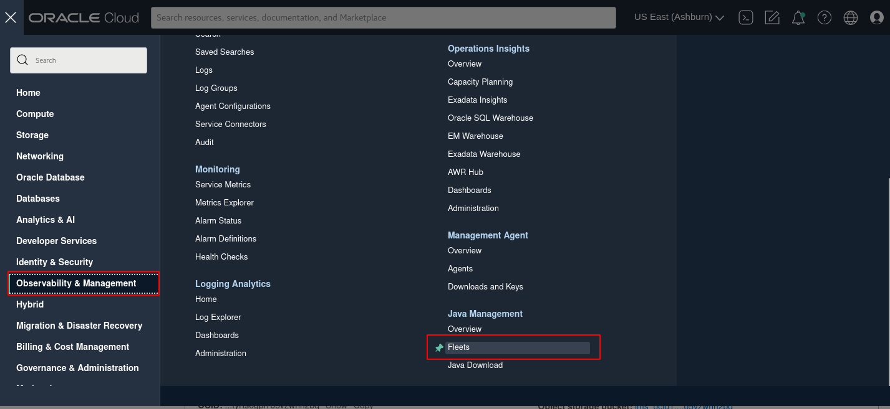
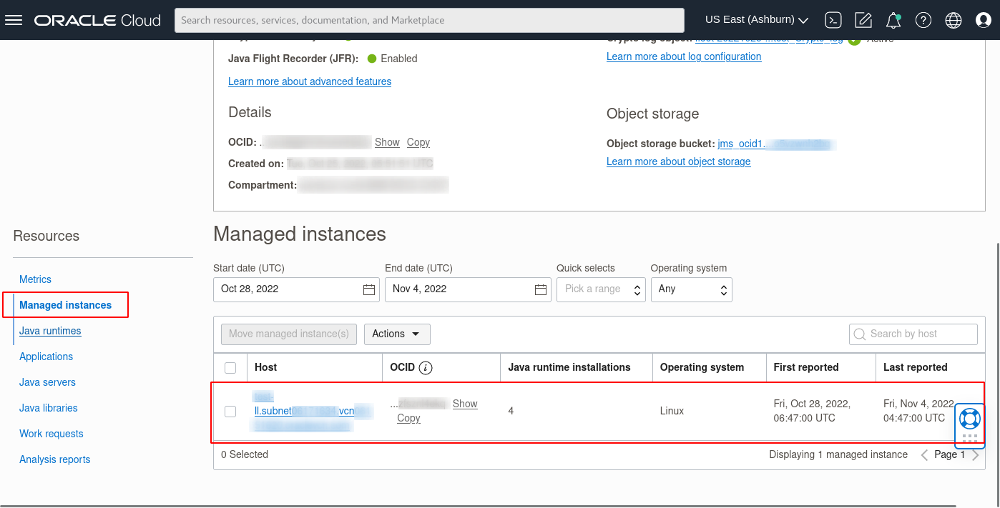
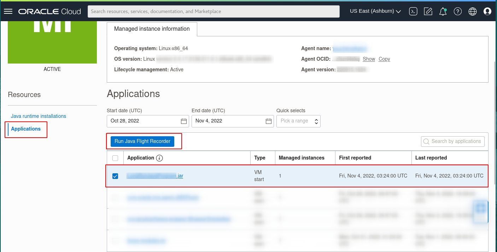
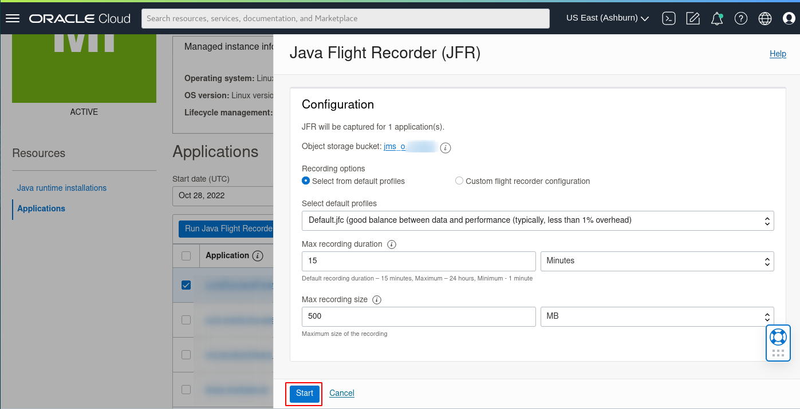
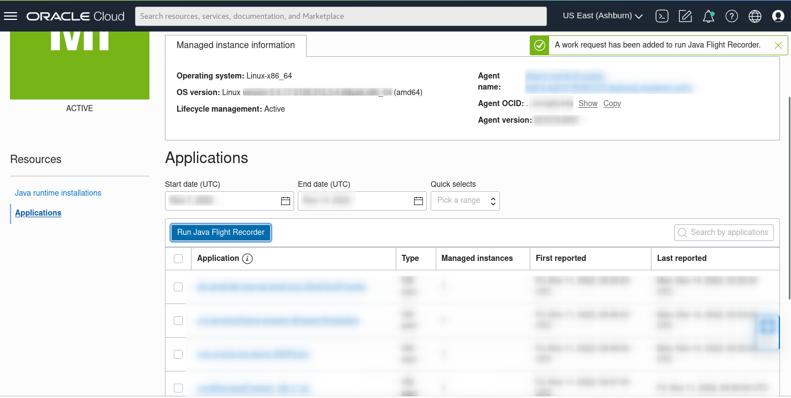
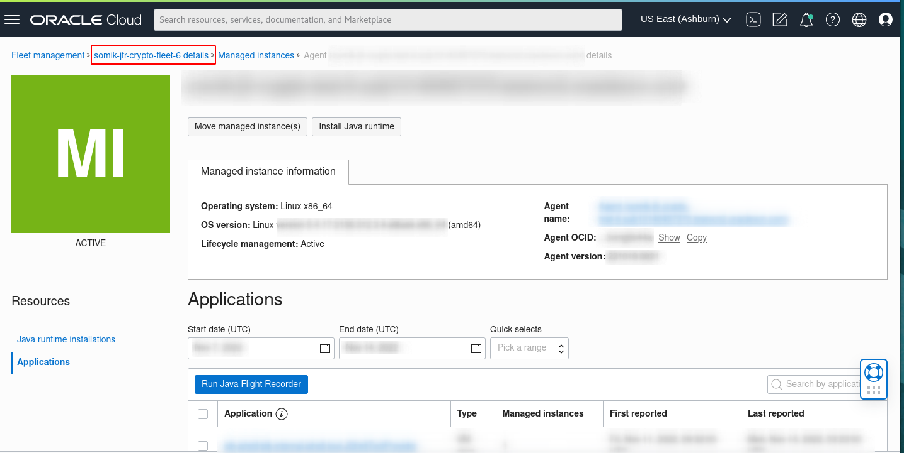
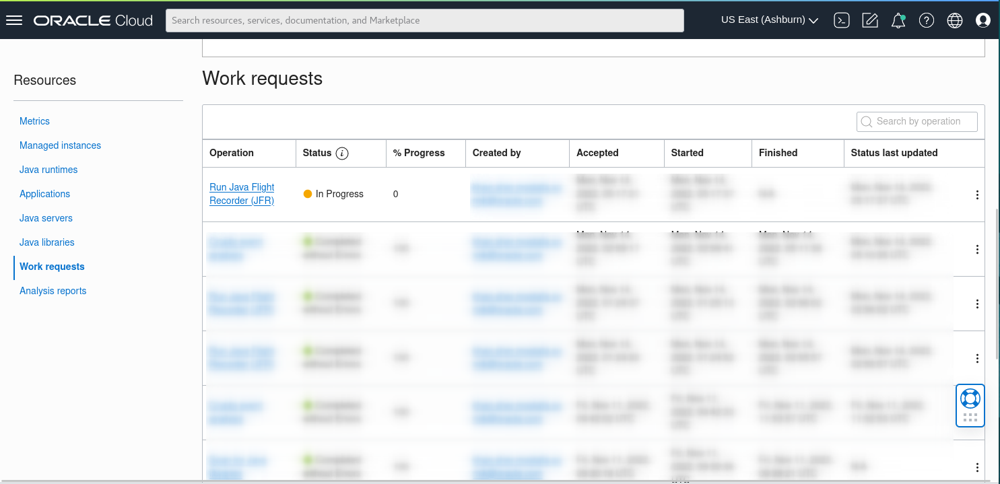
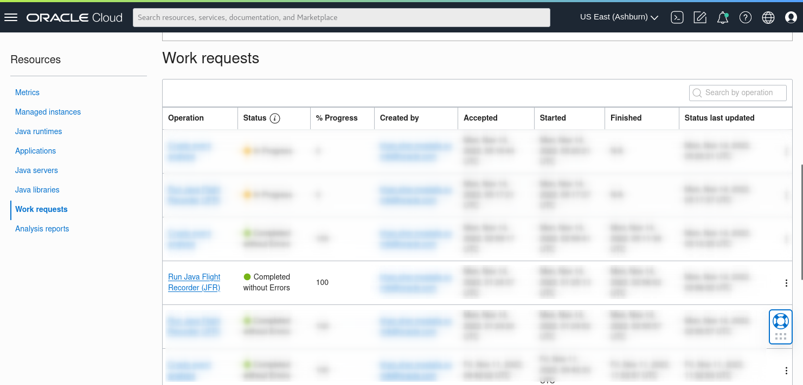
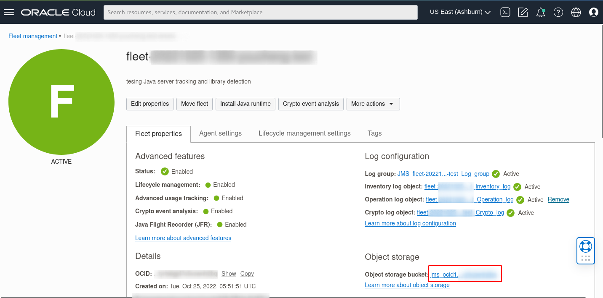

# Run Java Flight Recorder (JFR)

## Introduction

This lab walks you through the steps to run Java Flight Recorder (JFR) on any java app on your Fleet.

Estimated Time: 15 mins

### Objectives

In this lab, you will:

* Create a Java Flight Recorder Work Request using the Java Management Service console interface.
* View and monitor the status of Work Requests created using the Java Management Service console interface.
* Download the generated JFR file for further analysis.

### Prerequisites

* You have signed up for an account with Oracle Cloud Infrastructure and have received your sign-in credentials.
* You are using an Oracle Linux image or Windows OS on your Managed Instance for this workshop.
* Access to the cloud environment and resources configured in [Lab 1](?lab=set-up-and-enable-lcm-on-jms).
* Have java applications running in your instance from [Lab 5: Track Java Servers](?lab=track-java-servers).

## Task 1: Submit Java Flight Recorder Work Request

1. First, open the navigation menu, click **Observability & Management**, and then click **Fleets** under **Java Management**. Select the fleet that you have configured in [Lab 1](?lab=set-up-and-enable-lcm-on-jms).
  
    

2. Scroll down the **Fleet** details page. Under the **Resources** menu, select **Managed instances**.

    You should see a list of Managed instances that are currently in your Fleet. Select the Managed instance you are interested in.
  
    

3. Scroll down and under **Resources**, select **Applications**. You should see a list of Java applications running in this managed instance. Select the Java application you want to run with JFR and click **Run Java Flight Recorder** button.
  
    

4. In the **Java Flight Recorder** (JFR) Window, select **Recording option**: **Select from default profiles**

    Under the **Select default profiles**, click on the dropdown menu and select **Default.jfc**

    Lower the **Max recording duration** to **5 mins** and keep **Max recording size** at **500MB**. Click **Start** to begin the JFR recording.

    

    

5. Click on the **fleet** name at the top of the **Managed Instance** page. This should navigate back to the **Fleet** details page.

    

6. Scroll down to the **Resources** menu and select **Work requests**. You should see a list of the Work Requests that are currently in your Fleet. **Java Flight Recorder** that was started should be at the top of the list.
  
    

7. Wait for the work request to be processed. If the work request has been completed successfully, the status will change to **Completed without Errors**.
  
    

    >**Note:** It will take approximately 10 minutes for the request to be completed.

8. To access the report, navigate to the **Fleet** details page and click on the **Object storage bucket** name under **Object storage**.

    

9. Your **Java Flight Recorder** recording's raw copy is stored in the folder [PENDING CONTENT]

    

10. You can open the **Java Flight Recorder** recording in your favorite JFR viewer or you can use the Oracle's **JDK Mission Control** to view th files. 

    JMC download link: https://www.oracle.com/java/technologies/jdk-mission-control.html

 You may now **proceed to the next lab.**

## Acknowledgements

* **Author** - Somik Khan, November 2022
* **Last Updated By** - Somik Khan, November 2022
