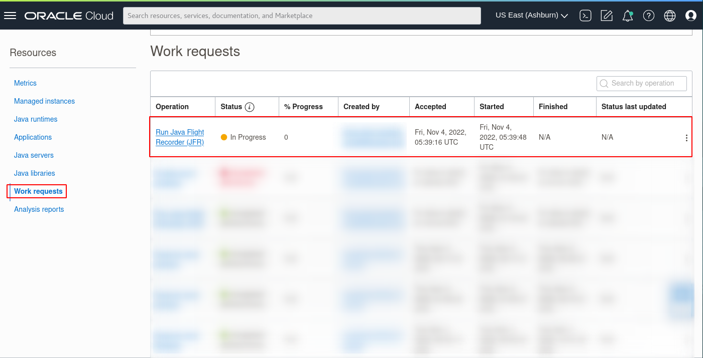
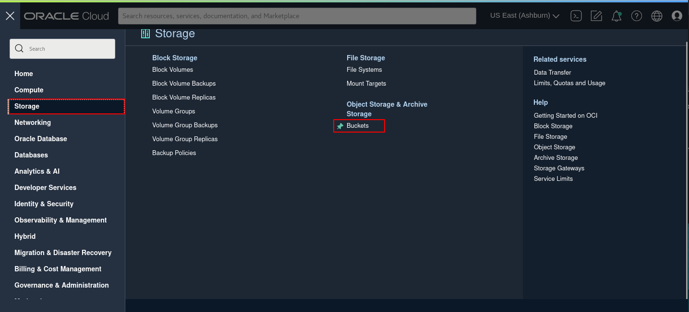
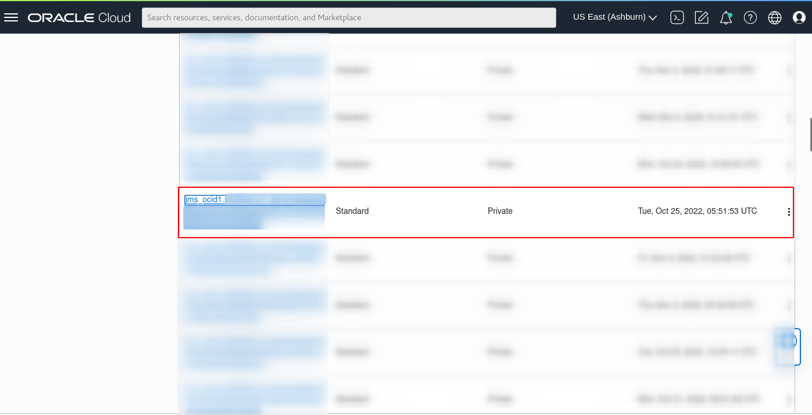

# Run Java Flight Recorder (JFR)

## Introduction

This lab walks you through the steps to run Java Flight Recorder (JFR) on any java app on your Fleet.

Estimated Time: 15 mins

### Objectives

In this lab, you will:

* Create a Java Flight Recorder Work Request using the Java Management Service console interface.
* View and monitor the status of Work Requests created using the Java Management Service console interface.
* Download the generated JFR file for further analysis.

### Prerequisites

* You have signed up for an account with Oracle Cloud Infrastructure and have received your sign-in credentials.
* You are using an Oracle Linux image or Windows OS on your Managed Instance for this workshop.
* Access to the cloud environment and resources configured in [Lab 1](?lab=set-up-and-enable-lcm-on-jms).

## Task 1: Submit Java Flight Recorder Work Request

1. First, open the navigation menu, click **Observability & Management**, and then click **Fleets** under **Java Management**. Select the fleet that you are interested in.
    
  

2. Scroll down and under **Resources**, select **Managed instances**. You should see a list of Managed instances that are currently in your Fleet. Select the Managed instance you are interested in.
    
  

3. Scroll down and under **Resources**, select **Applications**. You should see a list of Java applications running in this managed instance. Select the Java application you want to run with JFR and click **Run Java Flight Recorder** button.
    
  

4. Select **Select from default profiles** for **Recording options** and from the dropdown box, choose **Default.jfc**.
    
  For **Max recording duration** lower it to **5 mins** and keep **Max recording size** as is at **500MB**. Click **Start** to begin the JFR recording.
    
  

5. Scroll down and under **Resources**, select **Work requests**. You should see a list of the Work Requests that are currently in your Fleet. **Java Flight Recorder** that was started should be at the top of the list.
    
  

6. Once the work request shows as complete, open the navigation menu again, click **Storage**, and then click **Buckets** under **Object Storage & Archive Storage**.
    
  
    
  Select the bucket that starts with **jms_** followed by the **OCID** of your fleet that you are interested in.
    
  
    
  > **Note:** You can also access it from the **Fleet** details page by clicking the **Object storage bucket** name under **Object storage**
  >
  >

6. Download the **Java Flight Recorder** report by clicking XZXZXZXZXZXZ
    
  

 You may now **proceed to the next lab.**

## Acknowledgements

* **Author** - 
* **Last Updated By** - Somik Khan, November 2022
