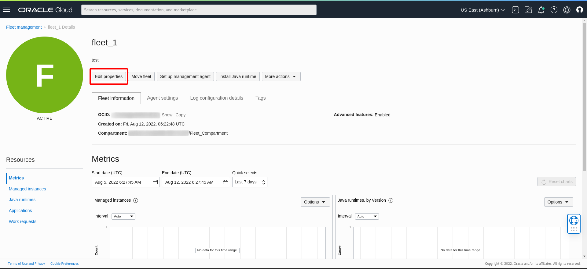
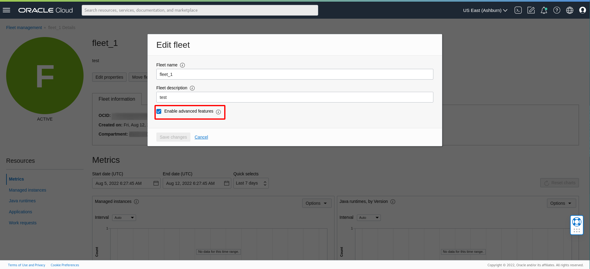

# Set up and enable Lifecycle Management operations on Java Management Service

## Introduction

Before you can start using Lifecycle Management operations, you must ensure that your Oracle Cloud Infrastructure environment is set up correctly by following the workshop [Manage Java Runtimes, Applications and Managed Instances Inventory with Java Management Service](https://apexapps.oracle.com/pls/apex/dbpm/r/livelabs/view-workshop?wid=912). These OCI Resources allow the communication between all the required components and cloud services.

Estimated Time: 10 minutes

### Objectives

In this lab, you will:

  *  Configure a fleet to enable LCM operations.

### Prerequisites

 * You have signed up for an account with Oracle Cloud Infrastructure and have received your sign-in credentials.
 * You are using an Oracle Linux image or Windows OS on your host machine or compute instance for this workshop.
 * You have successfully completed the installation of the Management Agent on your OCI or non-OCI hosts following steps in [Manage Java Runtimes, Applications and Managed Instances Inventory with Java Management Service](https://apexapps.oracle.com/pls/apex/dbpm/r/livelabs/view-workshop?wid=912).

## Task 1: Configure a fleet to enable LCM operations

1. In the Oracle Cloud Console, open the navigation menu, click **Observability & Management**, and then click **Fleets** under **Java Management**. Select the fleet that you are interested in.
  

2. Click **Edit Properties**.

  

3. Ensure that the **Enable advanced features** box is checked.

  

You may now **proceed to the next lab.**

## Learn More

* Refer to the [Managing Plugins with Oracle Cloud Agent ](https://docs.oracle.com/en-us/iaas/Content/Compute/Tasks/manage-plugins.htm#console)
* Refer to the [Installation of Management Agents ](https://docs.oracle.com/en-us/iaas/management-agents/doc/install-management-agent-chapter.htm). It has details of installation of Management Agent on various Operating Systems.
* Refer to the [Viewing a Java Runtime](https://docs.oracle.com/en-us/iaas/jms/doc/fleet-views.html#GUID-F57179D9-C736-4058-B381-9ECAC776895F) for details of all the field shown in Java Runtime table.

## Acknowledgements

* **Author** - Bhuvesh Kumar, Java Management Service
* **Last Updated By** - Bhuvesh Kumar, April 2022
