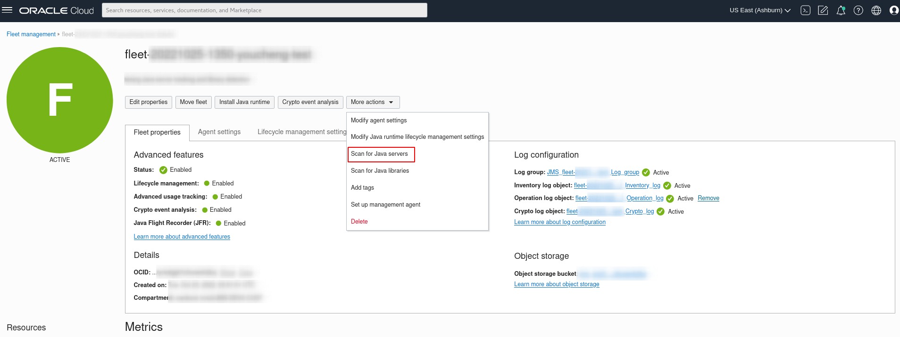
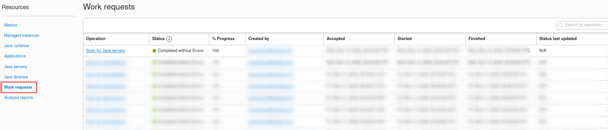
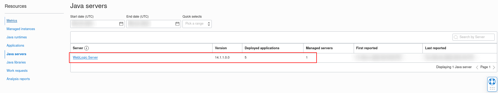

# Track Java Servers

## Introduction

Advanced usage tracking allows you to monitor the usage of Java servers in your fleet which includes the applications deployed on the Java server, the managed server and managed instances on which an application is deployed. 

This lab walks you through the steps to track Java servers in a managed instance.

Estimated Time: 40 minutes

### Objectives

In this lab, you will:

* Configure WebLogic server in a managed instance.
* Deploy a sample Java Web Application in WebLogic server.
* Scan running Java server with deployed Java Web Application in a managed instance.
* Verify Java server scanning result.

### Prerequisites

* You have signed up for an account with Oracle Cloud Infrastructure and have received your sign-in credentials.
* You are using an Oracle Linux image on your Managed Instance for this workshop.
* Access to the cloud environment and resources configured in [Lab 1](?lab=set-up-and-enable-advanced-features-on-java-management-service).
* Familiarity with configuration of WebLogic server.

## Task 1: Ensure WebLogic Server is installed and configured. 

1. If you do not have WebLogic server installed and configured in your managed instance, please refer to following steps.
* [Download WebLogic Server](https://www.oracle.com/middleware/technologies/weblogic-server-installers-downloads.html)
* [Install WebLogic Server](https://docs.oracle.com/en/middleware/standalone/weblogic-server/14.1.1.0/wlsig/installing-oracle-weblogic-server-and-coherence-software.html#GUID-E4241C14-42D3-4053-8F83-C748E059607A)
* [Create and Configure WebLogic Domain](https://docs.oracle.com/en/middleware/standalone/weblogic-server/14.1.1.0/wlsig/creating-and-configuring-weblogic-domain.html#GUID-4AECC00D-782D-4E77-85DF-F74DD61391B4)

2. When configuring the WebLogic server, please take note of the **absolute path to the domain directory created**. This path will be required for the subsequent task of deployment of Java Web Application.  
For example: **/home/opc/Oracle/Middleware/Oracle_Home/user_projects/domains/<domain_name>**

## Task 2: Create a Sample Java Web Application

1. Connect to your instance with SSH if you are using OCI Compute Instance.
* Open a Terminal or Command Prompt window. Change into the directory where you stored the SSH encryption keys you created. To use SSH command, you need to change the read and write permissions to your key with this command.
```
  <copy>
    chmod 400 ./<your-private-key-file>
  </copy>
```
* Connect to your instance with this SSH command
```
  <copy>
    ssh -i <your-private-key-file> opc@<x.x.x.x>
  </copy>
```
2. Install Maven with following command.
```
    <copy>
    sudo yum install maven
    </copy>
```  
3. Verify the installation by checking the Maven version with following command.
```
    <copy>
    mvn –v
    </copy>
```
* The Maven version should be displayed if it was successfully installed.

4. Create a sample Java Web Application.
* If you are not already in the home directory of your compute instance, navigate there with the following command:
```
    <copy>
    cd ~
    </copy>
```
* Create sample Java Web Application named **webSampleApp** with the following command:
```
    <copy>
    mvn archetype:generate -DgroupId=com.sample -DartifactId=webSampleApp -DarchetypeArtifactId=maven-archetype-webapp -DinteractiveMode=false
    </copy>
```
* Navigate to the directory of the created application with the following command:
```
    <copy>
    cd ./webSampleApp
    </copy>
```

5. Edit pom.xml configuration file.
* Open the pom.xml file with the following command:
```
    <copy>
    nano pom.xml
    </copy>
```
* Replace the content of the pom.xml file as follows:
```xml
<copy>
	<project
		xmlns="http://maven.apache.org/POM/4.0.0"
		xmlns:xsi="http://www.w3.org/2001/XMLSchema-instance"
        xsi:schemaLocation="http://maven.apache.org/POM/4.0.0 http://maven.apache.org/maven-v4_0_0.xsd">
		<modelVersion>4.0.0</modelVersion>
		<groupId>com.sample</groupId>
		<artifactId>webSampleApp</artifactId>
		<packaging>war</packaging>
		<version>1.0-SNAPSHOT</version>
		<name>webSampleApp</name>
		<url>http://maven.apache.org</url>
		<dependencies>
			<dependency>
				<groupId>junit</groupId>
				<artifactId>junit</artifactId>
				<version>3.8.1</version>
				<scope>test</scope>
			</dependency>
			<dependency>
				<groupId>com.fasterxml.jackson.core</groupId>
				<artifactId>jackson-databind</artifactId>
				<version>2.13.4</version>
			</dependency>
			<dependency>
				<groupId>javax.servlet</groupId>
				<artifactId>javax.servlet-api</artifactId>
				<version>4.0.1</version>
			</dependency>
		</dependencies>
		<build>
			<finalName>webSampleApp</finalName>
		</build>
	</project>
</copy>
```
* To save the file, type **CTRL+x**. Before exiting, nano will ask you if you wish to save the file: Type **y** and **Enter** to save and exit.

6. Edit web.xml configuration file.
* Open the web.xml file with the following command:
```
    <copy>
    nano src/main/webapp/WEB-INF/web.xml 
    </copy>
```
* Replace the content of the web.xml file with the content below. Save the file.
```xml
<copy>
	<?xml version="1.0" encoding="ISO-8859-1"?>
	<web-app
		xmlns="http://java.sun.com/xml/ns/j2ee"
		xmlns:xsi="http://www.w3.org/2001/XMLSchema-instance"
         xsi:schemaLocation="http://java.sun.com/xml/ns/j2ee http://java.sun.com/xml/ns/j2ee/web-app_2_4.xsd"
         version="2.4">
		<display-name>WebSampleApp</display-name>
		<servlet>
			<servlet-name>GreetingServlet</servlet-name>
			<servlet-class>com.sample.GreetingServlet</servlet-class>
		</servlet>
		<servlet-mapping>
			<servlet-name>GreetingServlet</servlet-name>
			<url-pattern>/greeting</url-pattern>
		</servlet-mapping>
	</web-app>
</copy>
```

7. Create a sample Java servlet class.
* Create and open the sample java servlet class file named **GreetingServlet.java** with command as following:
```
    <copy>
    sudo mkdir -p ./src/main/java/com/sample && sudo nano ./src/main/java/com/sample/GreetingServlet.java
    </copy>
```
* Copy and paste the following text into the Java file. Save the file.
```java
  <copy>
    package com.sample;
    import com.fasterxml.jackson.databind.ObjectMapper;
    import javax.servlet.http.*;
    import java.io.*;
    import java.text.SimpleDateFormat;
    import java.util.*;
    public class GreetingServlet extends HttpServlet {
      private String message;
      public void init() {
        message = "Hello! Nice to meet you !";
      }
      public void doGet(HttpServletRequest request, HttpServletResponse response) throws IOException {
        Map < String, String > map = new HashMap < String, String > ();
        map.put("Message", message);
        map.put("Time", new SimpleDateFormat("yyyy.MM.dd.HH.mm.ss").format(new java.util.Date()));
        String message = new ObjectMapper().writeValueAsString(map);
        response.setContentType("text/html");
        PrintWriter out = response.getWriter();
        out.println(message);
      }
    }
  </copy>
```

7. Build sample Java Web Application as war file using Maven.
```
  <copy>
    mvn package
  </copy>
```  
* You should able to see the output similar as following after successfully build.


## Task 3: Deploy a Java Web Application with WebLogic Server.

1. Deploy the sample Java Web Application in WebLogic server.
```
  <copy>
    cp ./target/webSampleApp.war  <path-to-created-domain>/autodeploy/
  </copy>
```  
2. Start WebLogic Server.
```
  <copy>
    sudo <path-to-created-domain>/startWebLogic.sh
  </copy>
``` 
* You should see the output similar as following after server started successfully.


> **Note:** By default, WebLogic is set to development mode with the auto-deploy feature enabled. The sample Java Web Application in the autodeploy directory will not be deployed if the auto-deploy feature is not available.

## Task 4: Initialize a Java server scan.

Now that we have a running WebLogic server with the sample Java Web Application deployed on the managed instance, let's initialize a **Java Server scan**.

1. Open the navigation menu, click **Observability & Management**. Under **Java Management**, select **Fleets**.
 

2. On the Fleet details page, click **Scan for Java servers**.

If your request is submitted successfully, you should receive a notification in green as seen below: 


3. Scroll down the Fleet details page, under **Resource** menu, select **Work Request**.You should see the Scan for Java servers Work Request you submitted in step 1. Wait for the work request to complete.


4. If your request is successful, you should see that the Status of the request is marked as **Completed without errors**.  
It will take approximately 10 minutes for the request to be completed.


5. In the same Fleet details page, under **Resource** menu, select **Java servers**. You should be able to see all the Java servers present in the fleet.


6. Click **WebLogic Server** under **Java servers**, You should be able to see the WebSampleApp that was deployed in Task 3 and its target type (clustered / non-clustered) under **Deployed applications**.


## Task 5: (Optional)Tracking other Java Servers with Deployed Applications
* Task 1 to 4 highlights the process of tracking a running Java server with deployed Web Application using WebLogic server as an example. The Java server scan is able to detect the latest versions of a variety of Java Servers including:
  * WebLogic
  * Tomcat
  * JBoss (JBoss EAP, JBoss AS/WildFly)

  
  

* Additionally, the Java server scan is also able to detect applications that have been deployed in a standalone (non-clustered) or clustered mode.
* Setting up of Java application servers including configuring cluster mode is beyond the scope of this workshop. You may wish to deploy the Java Applications using above mentioned Java servers on your own and scan it using our features.


 You may now **proceed to the next lab.**
## Learn More
* Refer to the [Java Runtime Lifecycle Management](https://docs.oracle.com/en-us/iaas/jms/doc/advanced-features.html#GUID-08673CB1-D87D-4BC5-A61D-E59DCC879ABB), [Work Request](https://docs.oracle.com/en-us/iaas/jms/doc/getting-started-java-management-service.html#GUID-47C63464-BC0C-4059-B552-ED9F33E77ED3) and [Viewing a Work Request](https://docs.oracle.com/en-us/iaas/jms/doc/fleet-views.html#GUID-F649F0E5-DD54-4DEC-A0F1-942FE3552C93) sections of the JMS documentation for more details.

* Use the [Troubleshooting](https://docs.oracle.com/en-us/iaas/jms/doc/troubleshooting.html#GUID-2D613C72-10F3-4905-A306-4F2673FB1CD3) chapter for explanations on how to diagnose and resolve common problems encountered when installing or using Java Management Service.

* If the problem still persists or it is not listed, then refer to the [Getting Help and Contacting Support](https://docs.oracle.com/en-us/iaas/Content/GSG/Tasks/contactingsupport.htm) section. You can also open a support service request using the **Help** menu in the OCI console.

## Acknowledgements

* **Author** - Youcheng Li, Java Management Service
* **Last Updated By** - Youcheng Li, November 2022
