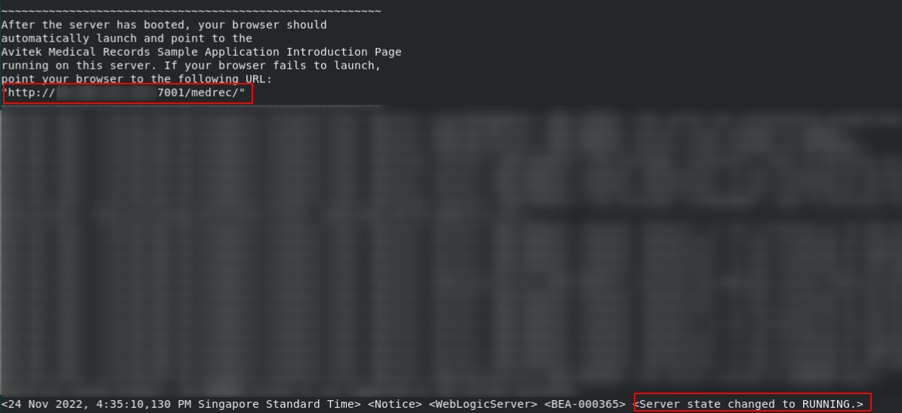
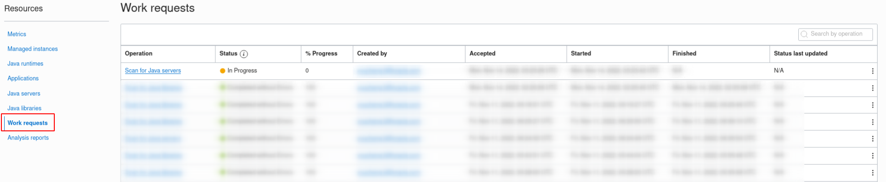
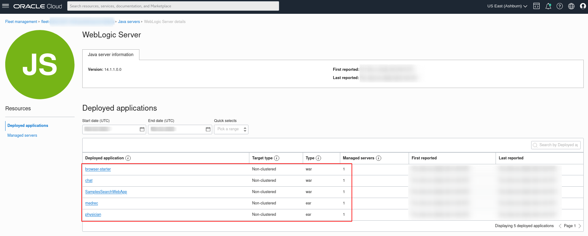

# Track Java Servers

## Introduction

Advanced usage tracking allows you to monitor the usage of Java servers in your fleet which includes the applications deployed on the Java server, and the managed server and managed instances on which an application is deployed. 

This lab walks you through the steps to track Java servers in a managed instance.

Estimated Time: 40 minutes

### Objectives

In this lab, you will:

* Install WebLogic Java Server in a managed instance.
* Deploy a sample Java Web Application in WebLogic Server.
* Scan running Java Server with deployed Java Application in a managed instance.
* Verify Java Server scanning.

### Prerequisites

* You have signed up for an account with Oracle Cloud Infrastructure and have received your sign-in credentials.
* You are using an Oracle Linux image on your Managed Instance for this workshop.
* Access to the cloud environment and resources configured in the previous labs.
* Familiarity with configuration of WebLogic Server.

## Task 1: Ensure WebLogic Server is installed and configured. 

1. If you do not have WebLogic server installed and configured in the managed instance, please follow steps:
* [Download WebLogic Server](https://www.oracle.com/middleware/technologies/weblogic-server-installers-downloads.html)
* [Install WebLogic Server](https://docs.oracle.com/en/middleware/standalone/weblogic-server/14.1.1.0/wlsig/installing-oracle-weblogic-server-and-coherence-software.html#GUID-E4241C14-42D3-4053-8F83-C748E059607A)
* [Create and Configure WebLogic Domain](https://docs.oracle.com/en/middleware/standalone/weblogic-server/14.1.1.0/wlsig/creating-and-configuring-weblogic-domain.html#GUID-4AECC00D-782D-4E77-85DF-F74DD61391B4)

2. Take note of the **path of the created domain** which will be used for deployment of Java Web Application in Task 3.

## Task 2: Create Sample Java Web Application

1. Install Maven by running. 
```
    <copy>
    sudo yum install maven
    </copy>
```  
2. Verify the installation by checking the Maven version.
```
    <copy>
    mvn –version
    </copy>
```  
3. Create sample Java Web Application by running.
* If you are not already in the home directory of your compute instance, navigate there by running this.
```
    <copy>
    cd ~
    </copy>
```
* Create sample Java Web Application by running.
```
    <copy>
    mvn archetype:generate -DgroupId=com.sample -DartifactId=webSampleApp -DarchetypeArtifactId=maven-archetype-webapp -DinteractiveMode=false
    </copy>
```
```
    <copy>
    cd ./webSampleApp
    </copy>
```

3. Edit configuration files by running.
* Edit pom.xml file by running.
```
    <copy>
    nano pom.xml
    </copy>
```
* Replace the content of pom.xml as following.
```xml
<copy>
	<project
		xmlns="http://maven.apache.org/POM/4.0.0"
		xmlns:xsi="http://www.w3.org/2001/XMLSchema-instance"
        xsi:schemaLocation="http://maven.apache.org/POM/4.0.0 http://maven.apache.org/maven-v4_0_0.xsd">
		<modelVersion>4.0.0</modelVersion>
		<groupId>com.sample</groupId>
		<artifactId>webSampleApp</artifactId>
		<packaging>war</packaging>
		<version>1.0-SNAPSHOT</version>
		<name>webSampleApp</name>
		<url>http://maven.apache.org</url>
		<dependencies>
			<dependency>
				<groupId>junit</groupId>
				<artifactId>junit</artifactId>
				<version>3.8.1</version>
				<scope>test</scope>
			</dependency>
			<dependency>
				<groupId>com.fasterxml.jackson.core</groupId>
				<artifactId>jackson-databind</artifactId>
				<version>2.13.4</version>
			</dependency>
			<dependency>
				<groupId>javax.servlet</groupId>
				<artifactId>javax.servlet-api</artifactId>
				<version>4.0.1</version>
			</dependency>
		</dependencies>
		<build>
			<finalName>webSampleApp</finalName>
		</build>
	</project>
</copy>
```
* Edit web.xml file by running.
```
    <copy>
    nano src/main/webapp/WEB-INF/web.xml 
    </copy>
```
* Replace the content of web.xml as following.
```xml
<copy>
	<?xml version="1.0" encoding="ISO-8859-1"?>
	<web-app
		xmlns="http://java.sun.com/xml/ns/j2ee"
		xmlns:xsi="http://www.w3.org/2001/XMLSchema-instance"
         xsi:schemaLocation="http://java.sun.com/xml/ns/j2ee http://java.sun.com/xml/ns/j2ee/web-app_2_4.xsd"
         version="2.4">
		<display-name>WebSampleApp</display-name>
		<servlet>
			<servlet-name>GreetingServlet</servlet-name>
			<servlet-class>com.sample.GreetingServlet</servlet-class>
		</servlet>
		<servlet-mapping>
			<servlet-name>GreetingServlet</servlet-name>
			<url-pattern>/greeting</url-pattern>
		</servlet-mapping>
	</web-app>
</copy>
```
4. Create sample Java servlet class by running.
* Create sample Java servlet class by running.
```
    <copy>
    sudo mkdir -p ./src/main/java/com/sample && sudo nano ./src/main/java/com/sample/GreetingServlet.java
    </copy>
```
* Paste the content as following.
```java
  <copy>
    package com.sample;
    import com.fasterxml.jackson.databind.ObjectMapper;
    import javax.servlet.http.*;
    import java.io.*;
    import java.text.SimpleDateFormat;
    import java.util.*;
    public class GreetingServlet extends HttpServlet {
      private String message;
      public void init() {
        message = "Hello! Nice to meet you !";
      }
      public void doGet(HttpServletRequest request, HttpServletResponse response) throws IOException {
        Map < String, String > map = new HashMap < String, String > ();
        map.put("Message", message);
        map.put("Time", new SimpleDateFormat("yyyy.MM.dd.HH.mm.ss").format(new java.util.Date()));
        String message = new ObjectMapper().writeValueAsString(map);
        response.setContentType("text/html");
        PrintWriter out = response.getWriter();
        out.println(message);
      }
    }
  </copy>
```

5. Build sample Java Web Application as war file by running.
```
  <copy>
    mvn package
  </copy>
```  
* You should able to see the output similar as following after successfully build.


## Task 3: Deploy Java Web Application in WebLogic Server.

1. Deploy sample Java Web Application in WebLogic server by running.
```
  <copy>
    cp ./target/webSampleApp.war  <path-to-created-domain>/autodeploy/
  </copy>
```  
2. Start WebLogic Server by running.
```
  <copy>
    sudo <path-to-created-domain>/startWebLogic.sh
  </copy>
``` 
* You should able to see the output similar as following after server started successfully.


## Task 4: Initialize a Java server scan.
Now we have running WebLogic server with deployed sample Java Web Application on the managed instance, let's initialize the Java server scan.
1. In **Java Management** page, click **Scan for Java servers**.


2. In the same **Java Management** page, under **Resource**,select **Work Request**.You should see the Scan for Java servers Work Request you submitted in step 1.


3. If your request was successful, you should see that the Status of the request is marked as Succeeded and Completed without errors.  
It may take around 10 minutes to be completed.


4. In the same **Java Management** page, under **Resource**, select **Java servers** you should be able to see detected WebLogic server that you installed in the managed instance.


5. Click **WebLogic Server** under **Java servers**, You should be able to see the WebSampleApp that we deployed in the previous step.


## Task 5: (Optional)Try your own to track other Java servers with deployed Java WEb Application.
* In the previous tasks . we have showed how to track a running java server with deployed web application using WebLogic Java server as an example. Not only WebLogic Java servers, tracking of Tomcat and JBoss Java servers are also supported for both standalone and cluster mode.


* Setting up of Java application servers including configuring cluster mode is beyond the scope this live labs. You may wish to deploy your own Java Applications using above mentioned Java servers and scan it using our features.


 You may now **proceed to the next lab.**
## Learn More
* Refer to the [Java Runtime Lifecycle Management](https://docs.oracle.com/en-us/iaas/jms/doc/advanced-features.html#GUID-08673CB1-D87D-4BC5-A61D-E59DCC879ABB), [Work Request](https://docs.oracle.com/en-us/iaas/jms/doc/getting-started-java-management-service.html#GUID-47C63464-BC0C-4059-B552-ED9F33E77ED3) and [Viewing a Work Request](https://docs.oracle.com/en-us/iaas/jms/doc/fleet-views.html#GUID-F649F0E5-DD54-4DEC-A0F1-942FE3552C93) sections of the JMS documentation for more details.

* Use the [Troubleshooting](https://docs.oracle.com/en-us/iaas/jms/doc/troubleshooting.html#GUID-2D613C72-10F3-4905-A306-4F2673FB1CD3) chapter for explanations on how to diagnose and resolve common problems encountered when installing or using Java Management Service.

* If the problem still persists or it is not listed, then refer to the [Getting Help and Contacting Support](https://docs.oracle.com/en-us/iaas/Content/GSG/Tasks/contactingsupport.htm) section. You can also open a support service request using the **Help** menu in the OCI console.

## Acknowledgements

* **Author** - Youcheng Li, Java Management Service
* **Last Updated By** - Youcheng Li, September 2022
