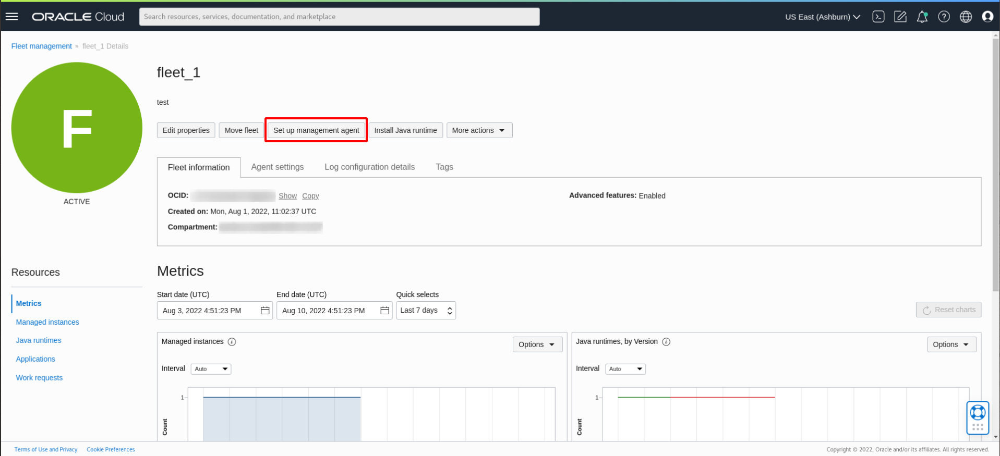
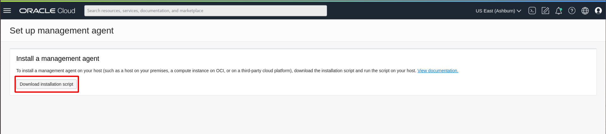
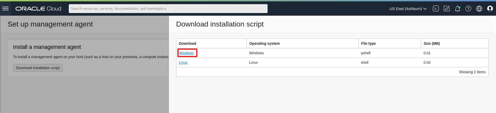
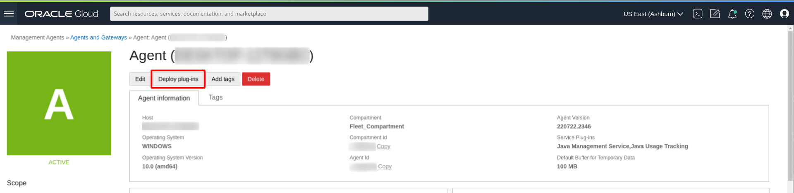
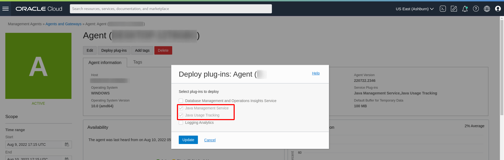

# Install Management Agent on Windows hosts

## Introduction

This lab walks you through the steps to install a management agent and deploy plug-ins on your host to allow Java usage tracking by the Java Management Service (JMS).

Estimated Time: 15 minutes

### Objectives

In this lab, you will:

- Install a Management Agent on a Windows host
- Verify Management Agent and Plug-ins
- Tag Management Agent and Compute Instance
- Monitor the Java runtime(s) and Java application(s) in JMS

### Prerequisites

* You have signed up for an account with Oracle Cloud Infrastructure and have received your sign-in credentials.
* You are using Windows OS on your host machine or compute instance for this lab.
* Access to the cloud environment and resources configured in [Lab 2](?lab=setup-a-fleet).

## Task 1: Prepare installation script for Management Agent installation


 1. First, open the navigation menu, click **Observability & Management**, and then click **Fleets** under **Java Management**. Select the fleet that you have created.
  

2. Click **Set Up Management Agent**.
  

3. Click **Download installation script** and select the script for Windows.
  
  


## Task 2: Install Management Agent

Install Management Agent (If your host is Linux, skip to [Lab 5: Install Management Agent on Linux hosts](?lab=set-up-of-management-agent-linux)).

1. To install the management agent software on Windows, perform the following steps:

2. Run Windows Powershell as administrator.

3. Enter the following command to unblock the installation script.

    ```
    <copy>
    Unblock-File -Path <path-to-installation-script>
    </copy>
    ```

4. Enter the following command to run the installation script. The installation may take some time to complete.

    ```
    <copy>
    & <path-to-installation-script>
    </copy>
    ```

## Task 3: Verify Management Agent Installation

1. In the Oracle Cloud Console, open the navigation menu, click **Observability & Management**, and then click **Agents** under **Management Agent**.

  


  2. From the Agents list, look for the agent that was recently installed. This Agent should be in the compartment created in [Lab 1](?lab=set-up-oci-for-jms).

      


## Task 4: Verify Plug-in Deployment

1. In your agent, click **Deploy plug-ins**.

  

2. The **Java Management Service** and **Java Usage Tracking** plug-ins should be checked.

  


## Task 5: Check that management agent is tagged with the Fleet OCID

1. In the Oracle Cloud Console, open the navigation menu, click **Observability & Management**, and then click **Fleets** under **Java Management**.

  

2. Select the Fleet created in [Lab 2](?lab=setup-a-fleet).

  


3. Take note of the fleet ocid.

  

4. In the Oracle Cloud Console, open the navigation menu and click **Observability & Management**, and then click **Agents**.
  

5. Select the compartment that the management agent is contained in.

  

6. Select the management agent to view more details

7. Under **Tags**, the `jms` tag will be indicated to show that the management agent is linked to that fleet. The fleet ocid under the jms tag should be the same fleet ocid noted in Step 3.

  

8. The management agent has been associated to your fleet in JMS. It will now collect information on your Java runtimes and Java Usage based on the scanning frequency defined in [Lab 2: Set Up a Fleet](?lab=setup-a-fleet).

## Task 6: Verify detection of Java applications and runtimes
For the logging of applications to be visible, Java applications must be run again after the installation of the Management Agent. Now that the Management Agent has been set up in your compute instance, it will be able to detect new Java applications that have been executed. This can be observed in the Oracle Cloud Console.

We shall demonstrate the detection of the Java compiler and HelloWorld application created in [Lab 3](?lab=deploy-a-java-application).
1. First, compile the HelloWorld.java file:

    ```
    <copy>
    javac HelloWorld.java
    </copy>
    ```

    Then execute the HelloWorld application:

    ```
    <copy>
    java HelloWorld
    </copy>
    ```

2. In the Oracle Cloud Console, open the navigation menu, click **Observability & Management**, and then click **Fleets** under **Java Management**.

  

3. Select the compartment that the fleet is in and click the fleet.

4. Click **Java Runtimes** under **Resources**. If tagging and installation of management agents is successful, Java Runtimes will be indicated on the Fleet Main Page after 5 minutes.

  You should see only one Java Runtime. This corresponds to the Java 8 installation from [Lab 3](?lab=deploy-a-java-application).

  

5. Click **Applications** under **Resources**. You should now see two applications. The first is from the javac compiler command and the second is from the HelloWorld application.

  

  You may now **proceed to the next lab.**


## Learn More
* Refer to the [Management Agent Concepts](https://docs.oracle.com/en-us/iaas/management-agents/doc/you-begin.html), [Installation of Management Agents](https://docs.oracle.com/en-us/iaas/management-agents/doc/install-management-agent-chapter.html) and
[JMS Plugin for Management Agents](https://docs.oracle.com/en-us/iaas/jms/doc/installing-management-agent-java-management-service.html) sections of the JMS documentation for more details.

* Use the [Troubleshooting](https://docs.oracle.com/en-us/iaas/jms/doc/troubleshooting.html#GUID-2D613C72-10F3-4905-A306-4F2673FB1CD3) chapter for explanations on how to diagnose and resolve common problems encountered when installing or using Java Management Service.

* If the problem still persists or if the problem you are facing is not listed, please refer to the [Getting Help and Contacting Support](https://docs.oracle.com/en-us/iaas/Content/GSG/Tasks/contactingsupport.htm) section or you may open a support service request using the **Help** menu in the Oracle Cloud Console.

## Acknowledgements

* **Author** - Esther Neoh, Java Management Service
* **Last Updated By** - Yixin Wei, June 2022
