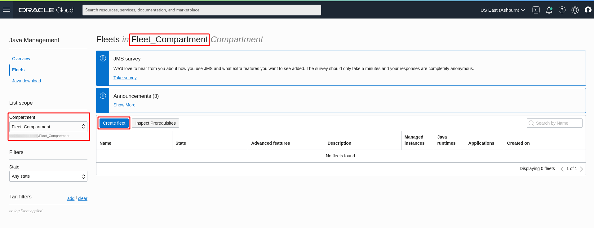
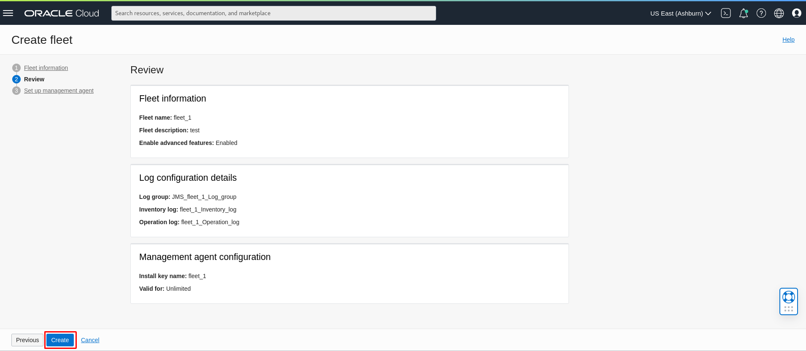
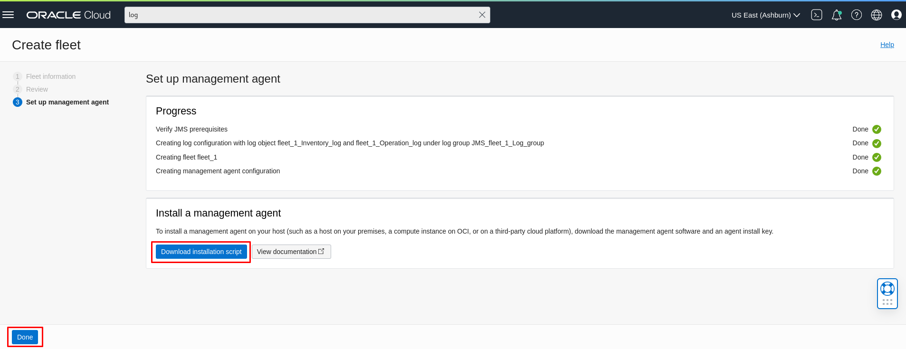
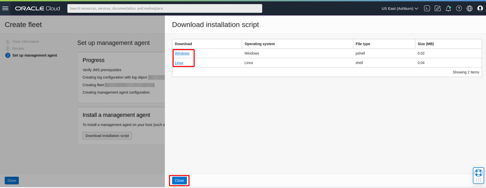
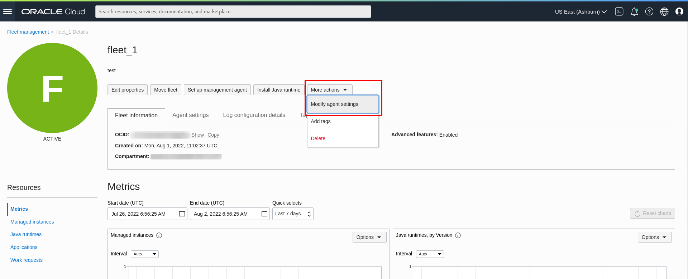
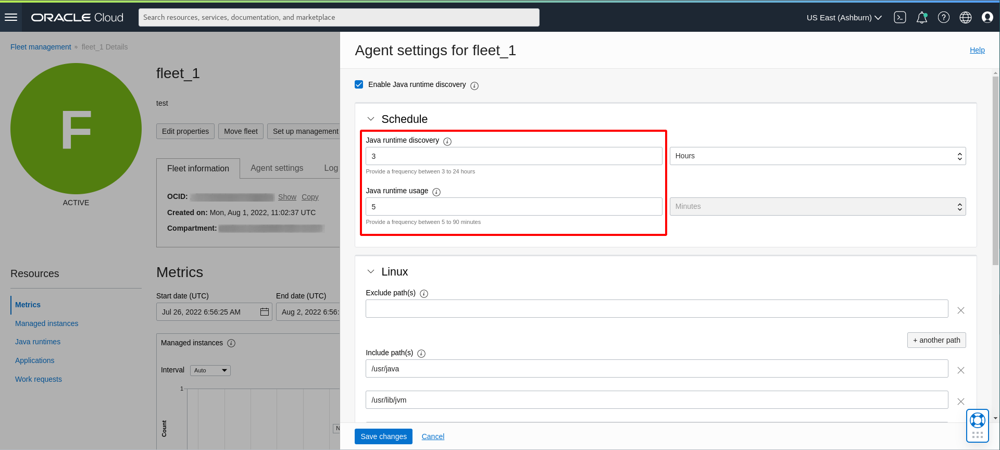

# Set up a Fleet

## Introduction

This lab walks you through the steps to set up a new fleet in Java Management Service (JMS).

Estimated Time: 5 minutes

### Objectives

In this lab, you will:

* Set up a Fleet using the Java Management Service user interface
* Download installation script to be used in [Lab 5: Install Management Agent on your Managed Instances](?lab=set-up-of-management-agent)

### Prerequisites

* You have signed up for an account with Oracle Cloud Infrastructure and have received your sign-in credentials.
* You are using an Oracle Linux image on your Managed Instance for this workshop.

## Task 1: Set Up Java Management Service Fleet

1. In the Oracle Cloud Console, open the navigation menu, click **Observability & Management**, and then click **Fleets** under **Java Management**.

  

2. Select the compartment created for JMS resources in Lab 1 (Compartment name should be **Fleet_Compartment**) and **Create Fleet**.

  

3. In the Create Fleet dialog box, enter a name for the Fleet Name (for example, `fleet_1`), and a description.

4. Select **Enable advanced features**.

  

  Click **Agree**. This is to enable advanced Lifecycle Management (LCM) operations. You can still edit it after the fleet is created.

  

  LCM is a part of JMS's reporting and management infrastructure. JMS enables users to observe and manage the lifecycles of their Java SE runtimes (on-premises or in the Cloud) by performing LCM operations such as installing or removing Java Runtimes. If you would like to learn more about the Lifecycle Management feature, you may refer to the [Perform Java Lifecycle Management with Java Management Service](https://apexapps.oracle.com/pls/apex/dbpm/r/livelabs/view-workshop?wid=3202).

5. Click **Next**.You are prompted to review the fleet information and management agent configuration. If you wish to modify your choices, click **Previous**.

6. Click **Create**. This creates a new fleet and its configuration.

  

7. Click **Download installation script**.

  

  Select an appropriate version of the installation script according to the operating system on your Managed Instance(s).

  

  Click **Close** and **Done** once the download is complete. The downloaded file will be used in [Lab 5: Install Management Agent on your Managed Instances](?lab=set-up-of-management-agent) to install the Management Agent. You can still download the installation script after the fleet is created.

8. After JMS is linked to the management agent, it will collect information on your Java runtimes. As the management agent will scan the instance periodically, the information may not appear immediately. The scanning frequency can be changed here.

9. Click the fleet. In the detail page, click on **Modify Agent Settings**.

  

10. Change the **Java Runtime Discovery** and **Java Runtime Usage** to the desired value. For this example, change **Java Runtime Discovery** to **3 hours**, and **Java Runtime Usage** to **5 minutes**.

  

You may now **proceed to the next lab**.

## Learn More

* Refer to the [Fleet Management](https://docs.oracle.com/en-us/iaas/jms/doc/fleet-management.html) section of the JMS documentation for more details.

* Use the [Troubleshooting](https://docs.oracle.com/en-us/iaas/jms/doc/troubleshooting.html#GUID-2D613C72-10F3-4905-A306-4F2673FB1CD3) chapter for explanations on how to diagnose and resolve common problems encountered when installing or using Java Management Service.

* If the problem still persists or if the problem you are facing is not listed, please refer to the [Getting Help and Contacting Support](https://docs.oracle.com/en-us/iaas/Content/GSG/Tasks/contactingsupport.htm) section or you may open a a support service request using the **Help** menu in the OCI console.

## Acknowledgements

* **Author** - Esther Neoh, Java Management Service
* **Last Updated By** - Yixin Wei, June 2022
